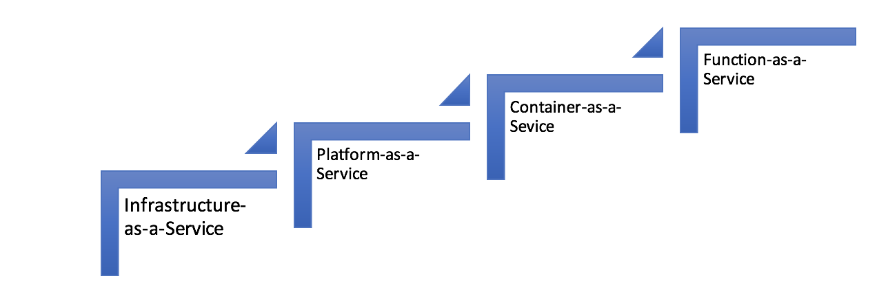

# Introduction to Serverless

Serverless is an overloaded word. Serverless means different things depending on the context. It could mean using third party managed services like Firebase, an event-driven architectural style, the next generation of compute service offered by cloud providers or it could mean a framework to build Serverless applications. This series will start with an introduction to a Serverless compute architecture. Once we understand the basics, we will start developing an application step by step.

A Serverless architecture is about building applications that react to events raised by services. These services are managed by the cloud provider and your code glues different services together to solve a particular problem.

Serverless computing goes against the idea of ***always on*** servers. The premise of Serverless computing is that you pay for servers only for the time they do the work. You don't pay for server idle time. No work equals no cost. There have been many [studies](https://gigaom.com/2013/11/30/the-sorry-state-of-server-utilization-and-the-impending-post-hypervisor-era/) that suggest most servers are less than 20% utilised, so building Serverless applications offer cost advantages. Serverless computing does not mean there are no servers involved. It simply means that developers don't have to think too much about servers. Your cloud provider will be responsible for provisioning, managing, patching and making servers available for your task. Serverless computing enables Serverless architectures. From now on, we will use _Serverless_ to mean computing and architecture together.

Serverless is also commonly know as ***Function as a Service*** or ***FaaS***.

Serverless computing or Function-as-a-service is the fourth way to consume cloud computing.

In the diagram shown above, as you move up the chain you raise the abstraction. Function-as-a-service or FaaS is the highest abstraction that cloud computing can offer.

1. IaaS abstracts hardware and the unit of scale is operating systems. It offers you full control with limited automation. You have to manage virtual servers yourself.
2. PaaS abstracts operating system and the unit of scale is your application. You care less about provisioning and managing servers and spend most of your time working on the application.
3. CaaS also abstracts the operating system and the unit of scale are containers. You package your application as a container image and the provider scales and orchestrates containers. Most PaaS providers have transformed themselves to CaaS so PaaS and CaaS might seem similar. I consider CaaS the next generation PaaS.
4. FaaS abstracts language runtime wherein functions (small piece of code) are the unit of scale. With FaaS, you only pay for the execution time of your function. AWS Lambda, for example, charges in increments of 100 milliseconds.

In this article series, we will build an online code evaluator that organizations can use to automate coding interview rounds. In this post, we will focus mainly on understanding and learning about the Serverless ecosystem. In the next post, we will start building the application step by step.

To understand Serverless, you should understand what it offers and the kind of application architecture it enables.

## What does Serverless offer?

Serverless offers us freedom from provisioning and managing servers. When many organisations moved to the cloud, they began managing virtual servers instead of physical servers, but they still managed servers. Containers moved the abstraction one level up but the way most organizations use containers is like a long lived process so you still have to manage them. A container is a process level abstraction that is managed by an orchestration tool like Kubernetes or Docker Swarm.  It is all about the level of abstraction. With Serverless, you get the highest possible abstraction.

### What characteristics does a Serverless architecture enable?

Serverless enables (or forces) you to write applications that are:

1. Event-driven
2. Microservices first
3. Polyglot
4. Stateless

## Difference with Platform-as-a-Service (PaaS)

I have worked with PaaS solutions over the past few years - mainly OpenShift, Heroku, and Cloud Foundry. One of the benefits promised by most PaaS providers is freedom from managing your own servers. While this is true, most PaaS solutions do not have a great auto-scaling story so you still have to think about scaling. Also, PaaS is suited for long running servers and are not as efficient at running a lot of small running processes. Another main difference is that FaaS influences your programming style because it forces you to think in terms of events, statelessness, and small loosely coupled components that, in the long run, lead to scalable applications.

Some people say,

> **Serverless is PaaS done right.**

## Hosted Cloud Serverless Solutions

The three popular Serverless public cloud solutions are:

1.  [AWS Lambda](https://aws.amazon.com/lambda/): It is the third compute service from Amazon. It is very different from the existing two compute services EC2 (Elastic Compute Cloud) and ECS (Elastic Container Service). AWS Lambda is an event-driven, serverless computing platform that executes your code in response to events. It manages the underlying infrastructure scaling it up or down to meet the event rate. You are only charged for the time your code is executed. AWS Lambda currently supports Java, Python, and Node.js language runtimes. 
2.  [MicroSoft Azure Functions](https://azure.microsoft.com/en-in/services/functions/): An event-based serverless compute experience to accelerate your development. It can scale based on demand and you pay only for the resources you consume.
3.  [Google Cloud Functions](https://cloud.google.com/functions/): A lightweight, event-based, asynchronous compute solution that allows you to create small, single-purpose functions that respond to cloud events without the need to manage a server or a runtime environment. Events from Google Cloud Storage and Google Cloud Pub/Sub can trigger Cloud Functions asynchronously, or you can use HTTP invocation for synchronous execution.

## Open-source Serverless implementations

Three open-source Serverless implementations are:

1. [Fission](http://fission.io/): It is a fast, extensible, open source serverless functions on any Kubernetes cluster.
2. [IBM OpenWhisk](https://developer.ibm.com/openwhisk): OpenWhisk provides a distributed compute service to execute application logic in response to events.
3. [IronFunctions](https://github.com/iron-io/functions): A serverless microservices platform written in Go from IronIO that supports the AWS Lambda format.

## Benefits of Serverless approach

There are many benefits of going the Serverless route:

1. Polyglot programming: One benefit the Serverless approach brings to the table is that as a programmer you can choose between different language runtimes depending on your use case. Amazon Lambda, for example, supports JVM, Node.js, Python, and C# runtimes. In the application use-case that we will build during the series, functions will be built using Node.JS, Java, and Scala. These functions will be loosely linked together via events.
2. Quicker to prototype: Serverless is all about leveraging tighter integration to cloud provider services. This leads to quick prototyping of ideas and reduces development time.
3. Cost: With the Serverless model you are only charged for the time it take the function to run. This means you don't have to pay for Server idle time. Serverless also leads to reduced operational costs because a lot of heavy lifting is done by the cloud provider.
4. Autoscaling: Serverless gives you true autoscaling without you tuning the knobs to meet your requirements. Your cloud provider can scale up function instances depending on the load.
5. Support for different types of applications: Using the Serverless approach, you can build both request/response and batch processing applications.

## Challenges of the Serverless approach

1. Poor local development story
2. Tools maturity
3. Platform lock-in
4. Cold start
5. Working as a team
6. Debugging support does not exist so it is difficult for developers to figure out what's happening.
7. How will different services work together? What if I want to use Firebase instead of DynamoDB?
8. When you can't work with local services, time of development increases. To check a very simple change you have to wait.
9. Development is costly because you must connect with AWS services.
10. Keep in mind when adding dependencies to your project, the more dependencies you add more time it will take to upload your package. So, try to keep package size as small as possible.

## Lambda coding patterns

1. Nanoservice: One lambda function per operation
2. Microservice: One lambda function per one kind of functionality (like all user operations go through one lambda function)
3. New monolithic: GraphQL + 1 function: All calls goes through one function

## Application: Lambda Coding Round Evaluator

In this hands-on article series, you will learn how to build an online code evaluator. In my current organization, one of the interview rounds is a coding round. Candidates are emailed an assignment that they must submit within a week. The assignment is then evaluated by an existing employee who decides whether candidate has passed or failed the round. I wanted to automate this process so that we can filter out inappropriate candidates without any human intervention. A task that can be automated should be automated. This is how the flow will work:

1. Recruitment team submits candidate details to the system.
2. System sends an email with an assignment zip file to the candidate based on the candidate's skills and experience. The zip file contains the problem as well as a Gradle or Maven project.
3. Candidate writes the code and submits the assignment using a Maven or Gradle task like `gradle submitAssignment`. The task zips the candidate's source code and submits it to the system.
4. On receiving assignment, the system builds the project and run all test cases.
   1. If the build fails, the candidate's status is updated to _failed_ in the system and the recruitment team is notified.
   2. If build succeeds, we find the test code coverage and if it is less than a threshold then we mark candidate status to _failed_ and recruitment team is notified.
5. If build succeeds and code coverage is above a threshold, then we run static analysis on the code to calculate the code quality score. If code quality score is below a threshold the candidate is marked _failed_ and a notification is sent to the recruitment team. Otherwise, the candidate passes the round and a human interviewer will now evaluate candidate's assignment.

To build `coding-round-evaluator`, I decided to use a Serverless architecture. The application stack will be composed of AWS APIs like Lambda, API Gateway, S3, and DynamoDB. We will use the Serverless framework to scaffold the applications and deploy functions.

Before we start building the application, let's understand the concept of Serverless and the ecosystem around it.

## Conclusion

In this part, you learnt basics of Serverless computing and the use case we will implement in this series. In the [next part](./02-building-rest-api-in-nodejs-with-lambda-gateway.md), we will build a REST API using the AWS web console.
